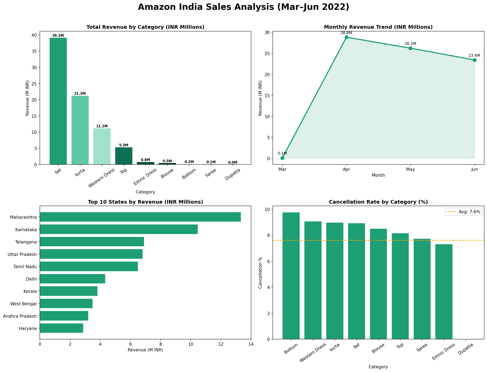

# 🛒 Amazon India Sales Analysis



## 📌 Overview
Exploratory data analysis on 120K+ real Amazon India orders to uncover revenue trends, top-performing categories, regional insights, and cancellation behavior.

## 🔍 Key Insights
- **Set** is the top category driving **~50% of total revenue (INR 39.2M)**
- **April** was the peak month with **INR 28.8M** in sales
- **Maharashtra** leads all states with **INR 13.3M** in revenue
- Overall cancellation rate is a healthy **8.9%**

## 📊 Analysis Covered
- Revenue breakdown by product category
- Monthly revenue trend (Mar–Jun 2022)
- Top 10 states by revenue
- Cancellation rate by category

## 🛠️ Tools & Libraries
| Tool | Purpose |
|------|---------|
| Python | Core language |
| Pandas | Data manipulation |
| Matplotlib | Static visualizations |
| Seaborn | Statistical plots |
| Plotly | Interactive charts |

## 📁 Dataset
Download the dataset from Kaggle:
[Amazon Sale Report](https://www.kaggle.com/datasets/thedevastator/unlock-profits-with-e-commerce-sales-data)

## 🚀 How to Run
1. Clone the repo
```bash
git clone https://github.com/YOUR_USERNAME/amazon-sales-analysis.git
```
2. Download the dataset from the link above and place it in the project folder
3. Open `Amazon_Sales_Analysis.ipynb` in Jupyter Notebook
4. Run all cells

## 👤 Author
**Mohamed Omar**  
HR Professional | Aspiring Data Analyst  
[LinkedIn](https://www.linkedin.com/in/muhamed-omar-8a5a983a9/)

---
⭐ If you found this useful, give it a star!
